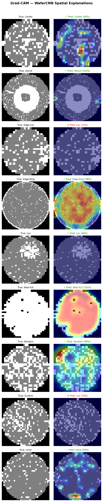

## Wafer Defect Detection & Yield Risk Dashboard

> An end-to-end AI decision-support tool for semiconductor wafer defect classification,
> spatial explainability, and yield-risk estimation.

**Domain:** Computer Vision · Industrial AI · Semiconductor Manufacturing  
**Stack:** Python · PyTorch · Streamlit · Grad-CAM · scikit-learn

🔗 **[Live Dashboard](https://wafer-defect-detection.streamlit.app)** · **[GitHub](https://github.com/Abdulsamedsay/wafer-defect-detection-dashboard)**

---

## Business Problem

In semiconductor manufacturing, wafers are inspected for defective dies after each process step. The *spatial pattern* of failing dies is not random — it encodes information about what went wrong: a contaminated center, a misaligned edge exposure, a physical scratch from handling.

Classifying these patterns early and reliably allows process engineers to:
- Diagnose equipment or process failures faster
- Decide whether to quarantine or continue a wafer lot
- Reduce yield loss by catching systematic problems before they propagate

This project builds a decision-support tool that mirrors that workflow: given a wafer map, it predicts the defect class, explains which regions drove the prediction, and assigns a yield-risk score with a recommended engineering action.

---

## Project Goal

Build an end-to-end system that takes a wafer map image as input and produces:

```
Predicted Defect:   Edge-Ring
Confidence:         96%
Risk Level:         HIGH
Recommended Action: Hold wafer. Engineer review required before processing continues.
Attention Region:   [Grad-CAM heatmap highlighting the outer edge ring]
```

The system is not positioned as a production quality-control replacement. It is a prototype demonstrating how industrial AI decision-support tools are designed and evaluated.

---

## Dataset — WM-811K

Publicly available dataset from real semiconductor fabrication processes.

| Property | Value |
|---|---|
| Total wafer maps | 811,457 |
| Labeled samples used | 172,950 |
| Unlabeled samples dropped | 638,507 |
| Defect classes | 9 |
| Resolution (after resize) | 64 × 64 |
| Class imbalance ratio | 989× (`none` vs `Near-full`) |
| Dominant class | `none` — 85.2% of labeled data |

**Defect classes:** Center · Donut · Edge-Loc · Edge-Ring · Loc · Near-full · Random · Scratch · None

**Key challenge:** A model that always predicts `none` achieves 85% accuracy. Accuracy is meaningless here — Macro F1 is the primary metric.

---

## Methodology

### 1. Preprocessing
- Resize all wafer maps to 64×64 using nearest-neighbor interpolation (preserves categorical pixel values 0/1/2)
- Normalize: divide by 2.0 → values in {0.0, 0.5, 1.0}
- Stratified 70/15/15 train/val/test split
- Class weights applied to loss function (Near-full weight: 129×)

### 2. Baseline
Two non-deep-learning baselines established:
- **SGD Logistic Regression** on flattened 64×64 maps: Macro F1 = 0.552
- **Random Forest** (30k stratified subset): near-perfect precision on majority class, near-zero recall on rare classes — confirms accuracy is misleading

### 3. CNN Model — WaferCNN
Custom 3-block CNN trained in PyTorch:

```
Input (1×64×64)
→ Conv(32) + BN + ReLU + MaxPool  →  (32×32×32)
→ Conv(64) + BN + ReLU + MaxPool  →  (64×16×16)
→ Conv(128) + BN + ReLU + MaxPool →  (128×8×8)
→ FC(256) + Dropout(0.5)
→ FC(9) → Logits
```

- 2.2M trainable parameters
- Class-weighted CrossEntropyLoss
- Adam optimizer, early stopping on val Macro F1
- Augmentation: random horizontal/vertical flips only (no rotation — defect orientation is meaningful)
- Trained ~39 minutes on CPU

### 4. Explainability — Grad-CAM
Gradient-weighted Class Activation Mapping applied to the last convolutional layer (output: 128×8×8, upsampled to 64×64). Shows which spatial regions of the wafer map drove each prediction.

### 5. Yield-Risk Scoring
A post-prediction risk layer maps (defect class, confidence) → risk level:

| Risk Level | Classes |
|---|---|
| Low | None |
| Medium | Random, Loc, Donut |
| High | Center, Edge-Loc, Edge-Ring, Scratch |
| Critical | Near-full |

If model confidence < 70%, risk is elevated by one level (conservative — uncertain predictions trigger review rather than clearance).

### 6. Dashboard
Interactive Streamlit dashboard with 4 pages: Project Overview, Prediction (live Grad-CAM + risk card), Model Performance, Dataset Insights.

---

## Results

Evaluated on the held-out test set (25,943 wafers, never seen during training).

| Metric | Baseline (LogReg) | WaferCNN |
|---|---|---|
| Accuracy | 94.3% | **86.6%** |
| **Macro F1** | 0.552 | **0.686** |
| Weighted F1 | — | **0.899** |

> Note: Baseline accuracy is high because it mostly predicts `none`. WaferCNN trades overall accuracy for much better coverage of rare defect classes — which is the goal.

**Per-class F1:**

| Class | F1 | Support |
|---|---|---|
| Edge-Ring | 0.959 | 1,452 |
| none | 0.930 | 22,115 |
| Near-full | 0.913 | 22 |
| Center | 0.842 | 644 |
| Random | 0.759 | 130 |
| Donut | 0.748 | 83 |
| Edge-Loc | 0.514 | 779 |
| Loc | 0.405 | 539 |
| Scratch | 0.102 | 179 |

Scratch (F1=0.102) is the hardest class: thin linear defects lose structural detail at 64×64 resolution, and the class has very limited training examples even with class weighting.

---

## Explainability

Grad-CAM heatmaps confirm the model learned geometrically meaningful features:
- **Edge-Ring** predictions highlight the outer ring
- **Center** predictions highlight the wafer center
- **Scratch** predictions show diffuse attention — consistent with the model's difficulty on this class



---

## Dashboard

```
streamlit run app/streamlit_app.py
```

**Prediction page:** select a defect class → see a test-set wafer map, Grad-CAM overlay, class probability chart, and a color-coded risk card with recommended action.

---

## Risk Scoring

```python
from src.risk_scoring import score

result = score("Edge-Ring", confidence=0.96)
# result.risk_level       → "High"
# result.recommended_action → "Hold wafer. Engineer review required..."
# result.color              → "#e67e22"
```

---

## Project Structure

```
wafer-defect-detection-dashboard/
├── src/
│   ├── data_loader.py       # WM-811K pickle compatibility fix
│   ├── preprocessing.py     # Resize, normalize, split, save
│   ├── dataset.py           # PyTorch Dataset + DataLoaders
│   ├── model.py             # WaferCNN architecture
│   ├── train.py             # Training loop with early stopping
│   ├── evaluate.py          # Metrics, confusion matrix
│   ├── explainability.py    # Grad-CAM implementation
│   └── risk_scoring.py      # Yield-risk scoring layer
├── app/
│   └── streamlit_app.py     # Interactive dashboard (4 pages)
├── notebooks/
│   ├── 01_data_exploration.ipynb
│   ├── 02_preprocessing.ipynb
│   ├── 03_baseline_model.ipynb
│   ├── 04_cnn_training.ipynb
│   └── 05_evaluation.ipynb
├── data/raw/                # LSWMD.pkl (not tracked in git)
├── data/processed/          # Preprocessed .npy arrays
├── models/                  # Saved model checkpoint
└── docs/                    # Project knowledge base
```

---

## What I Learned

- **Accuracy is not a metric** when classes are imbalanced 989×. Macro F1 gives equal weight to all classes regardless of support — that is the right lens for this problem.
- **Class weighting alone is not enough** for extreme minority classes. Scratch (179 test samples) remains hard even with a 34× training weight. More data or targeted augmentation would be the next step.
- **Grad-CAM reveals what the model actually learned** — not just whether it got the answer right. The heatmaps for Edge-Ring and Center are geometrically clean; for Scratch they are diffuse, which explains the low F1 before looking at any metric.
- **Industrial AI framing matters.** Wrapping a classification model in a risk scoring layer and explainability pipeline is what makes it a decision-support tool rather than an academic exercise.

---

## Future Improvements

- Transfer learning from ResNet18 or EfficientNet-B0 (pretrained on ImageNet, adapted to single-channel wafer maps)
- Higher input resolution (128×128) to preserve Scratch detail
- Targeted augmentation for hard classes (synthetic scratches, rotations)
- MLflow experiment tracking
- Deploy to Streamlit Cloud
- FastAPI prediction endpoint for integration testing

---

## Tech Stack

| Category | Tools |
|---|---|
| Language | Python 3.13 |
| Deep Learning | PyTorch 2.11 |
| Data Processing | pandas, NumPy, scikit-learn, OpenCV |
| Visualization | matplotlib, seaborn, Plotly |
| Explainability | Grad-CAM (custom implementation) |
| Dashboard | Streamlit 1.57 |
| Dataset | WM-811K (LSWMD.pkl, Kaggle) |

